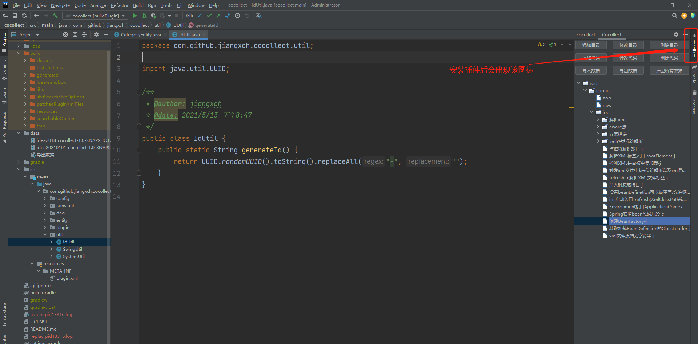

# Cocollect

一个简便的代码片段存储IDEA插件。

## 插件起源

1. 开发时候每次遇到List转Map，List转Map<String,List<String>>，目录树结构转换都需要使用搜索引擎搜索（因为长时间不用又忘记了），或者查找以前做过的项目，但感觉都很浪费时间，所以想做一个插件来存储**常用代码片段**。
2.  业务开发时，一些依赖第三方jar的方法只能记得有这么个东西，每次用到时候就需要取找一遍，从前端抓包看url，在打开后端项目看controller，一路跟进方法底层，非常麻烦，能否有个东西能一步到位？写一个插件存储方法位置，**想用时直接跳转到对应的方法**。
3.  第三方框架中常常有着许多简便的方法，在开发中使用这些代码非常的简便，这也是看源码的原因之一。但是在看了源码之后常常会出现，似乎某某框架有这个功能的代码，于是乎又去从框架入口往下再深入分析一波，等分析完，产品已经开始了下一个需求。

基于以上几点，想写一个插件来增加开发的效率。

## 特性

1.目录以及代码片段的增删查改

2.导入导出方便数据移动

## 快速开始

### 1.插件安装

#### 方式一：

使用源码中data目录下的zip包直接进行插件安装，注意选择自己IDEA对应版本的包。

### 2.打开插件窗口

### 3.保存代码片段

在使用时候可以直接选中存储的文本，通过快捷“ ”（空格），可以直接进行复制。

#### 方式一：通过菜单保存

#### 方式二：快捷插入

进行第二步后，会弹出：

选择"quickInsertCodeSegmentAction"后，会弹出保存代码片段的窗口。

### 4.使用代码片段

使用时候很简单，选中代码片段，点击键盘的“ ”（空格），即可将代码片段复制到剪贴板。

    

> 代码片段都是以“-j”或者“-c”结尾，以便和空目录进行区分（空目录图标与代码图标相同），“-j”表示jump，表示存储的代码是可以直接通过跳转，存储的是IDEA使用快捷键"shift+ctrl+alt+c"复制出来的类签名或者方法签名，可以在IDEA钟通过“ctrl+n”呼出搜索栏直接跳转过去，比如“org.springframework.context.support.AbstractApplicationContext#obtainFreshBeanFactory”。“-c”表示code，表示存储常用的代码片段。这两个标识是通过存储的文本是否包含空去区分的（通常代码片段都是含有空格的）。

